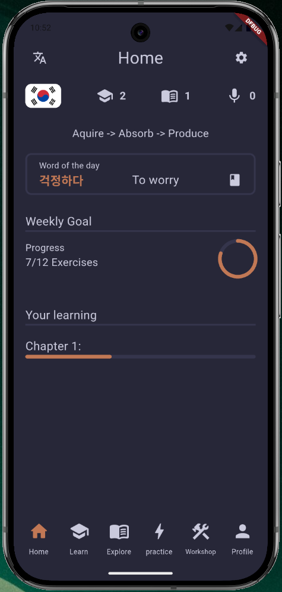
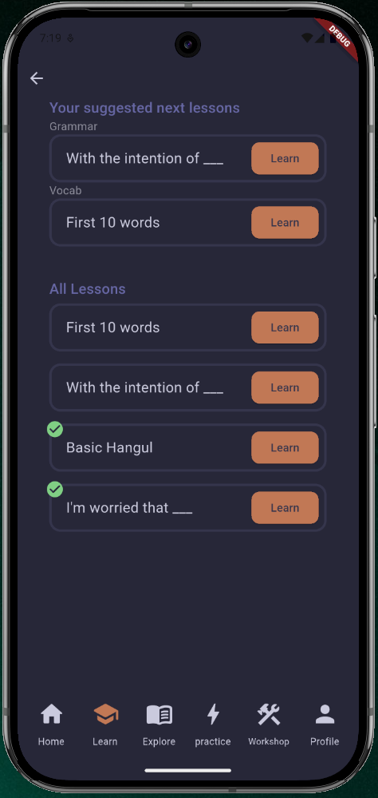
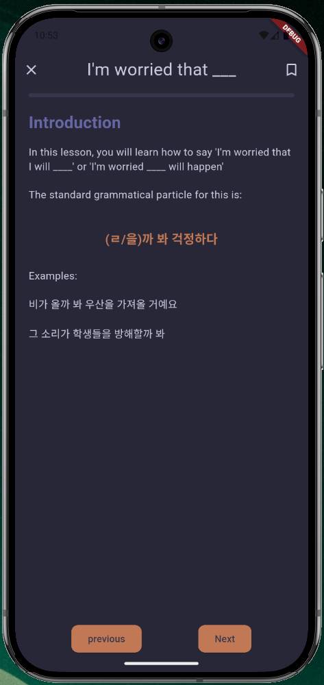
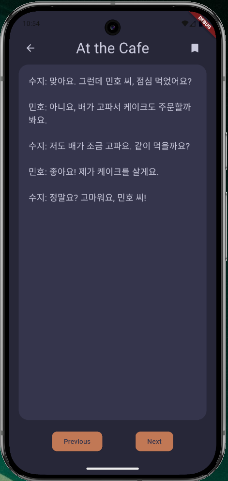

# LingIt - mobile app
## Description
LingIt is a mobile application for android (not released yet) that is designed for language learners who want more than just being able to ask where the bathroom is. 
While other language apps are designed to make you _feel_ like you're learning a language, the goal of LingIt is to help you actually learn it. No BS gameification, just high quality lessons and exercises.
While using LingIt, you follow a 3 step process: 
1. Acquire - On the 'Learn' page you go through grammar and vocabulary exercises to aquire new knowledge.
2. Absorb - With the 'Explore' page, you can read stories, and listen to audio exercises to see what you've learned in a natural context.
3. Produce - Finally, you take your new knowledge and use it in various ways  with the 'practice' page. Use automatically generated flashcards, or try writing a diary entry from a prompt.

## Planned Roadmap
### v0.1 - Apr 15
This will be the first closed beta of the app as required by Google Play's launch requirements.
Features will include: 
 _(Done)_
- Vocab and Grammar exercises.
- Short stories with comprehension quizzes
- Flashcard practice
- A workshop for bookmarking lessons or stories

 _(Not done)_
- A full dictionary for the words you will learn with example sentences
- Progress and goal tracking
- Writing exercise promts for various lessons with suggested vocab

Note: Lessons and exercises may be lacking in content, the main goal of this release is a 'proof of concept'

### v1.0 - May 20
This will be the first full public release of the app.
Features will include:
- 3 full chapters for learning beginner Korean
- Each chapter will have 10-15 grammar and vocab lessons
- Each chapter will have 4-6 stories
- The ability to download chapters from the google play services

### Note
There will be releases in between v0.1 and v1.0 for bug fixes and small updates to UI/UX but nothing big planned so they are not in this roadmap

## Screenshots
### Home Screen
This page contains an overview of your learning stats. Also quick links coming soon

### Learn Screen
This is where you perform the "Aqcuire" step of the process.   You can follow the suggested lesson path or choose whatever looks most fun to you!

### Lesson Screen
When you are going through a lesson, whether grammar or vocabulary, the screen will look like this. A progress bar is shown at the top under the lesson title to indicate how far through you are. Each lesson is formatted in a way to look stylish yet practical.
 Note: You can Bookmark a lesson using the button a the top right, this will place it in your workshop

### Story Screen
One of the best features of the app is the stories in each chapter. These are designed to match the difficulty and vocabulary of the chapter to ensure comprehension. There are also mini quizes at the end to test your comprehension skills. 

